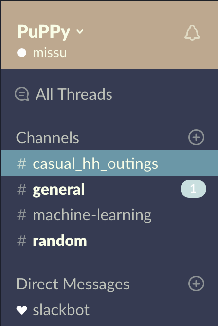
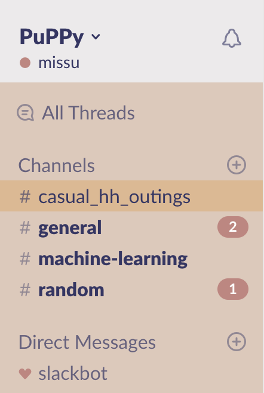
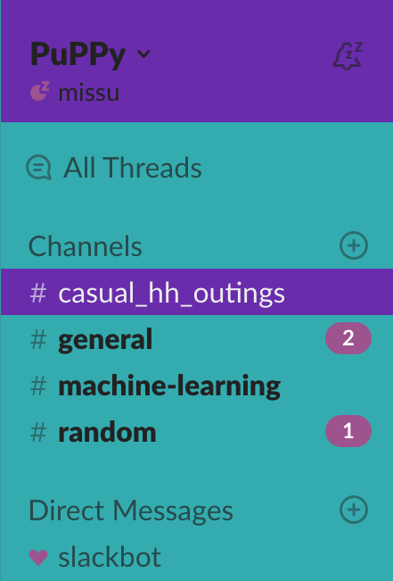
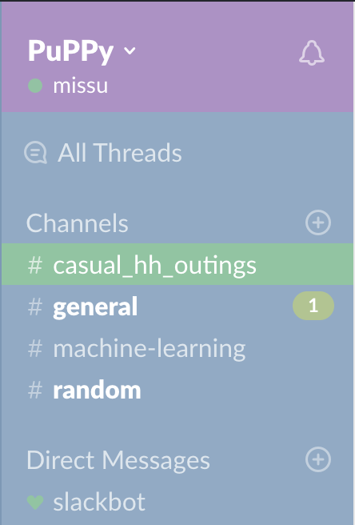
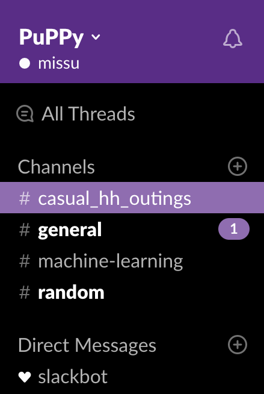

words words words

I have hundreds of color schemes I've saved on Adobe Color (formally Kuler), colourlovers.com, and my hardrives for years. They do not all have names, so most of them will just refer to the main color(s) in the theme and a number. Please let em know If I've reused the same name more than once.  
 The Color order is ROYGBIV, but with Grays and Blacks first.


### Seattle Skyline



```
#363B52,#BdA88F,#6B97A7,#F9FDE7,#6B97A7,#F9FDE7,#FFFFFF,#C9DFDF
```

### Salsa


```
#CC3333,#FF9900,#FFFFFF,#FF9900,#FF9900,#FFFFFF,#FFFFFF,#FFCC00
```

### 100 Year Old Man


```
#1E1D23,#DB9A41,#C42D20,#EBE0C0,#C42D20,#EBE0C0,#EBD151,#EBD151
```

### Muted 100 Year Old Man



```
#DCC9bb,#ECEAEB,#DBB994,#353662,#ECEAEB,#353662,#BC8781,#BC8781
```

### Water and Sand


```
#4682B4,#191970,#191970,#FFFFFF,#4682B4,#FFEBCD,#FFFFFF,#191970
```
### Tealpurp



```
#34ACAF,#692DAC,#692DAC,#EEEEEE,#9D538E,#222222,#9D538E,#9D538E
```


### Muted Love


```
#92AAC4,#AC92C4,#92C4A2,#FFFFFF,#AC92C4,#FFFFFF,#92C4A2,#B2C492
```

### Purple Theme 1


```
#000000,#592D86,#8F6DB0,#FFFFFF,#3E313C,#FFFFFF,#FFFFFF,#8F6DB0
```
